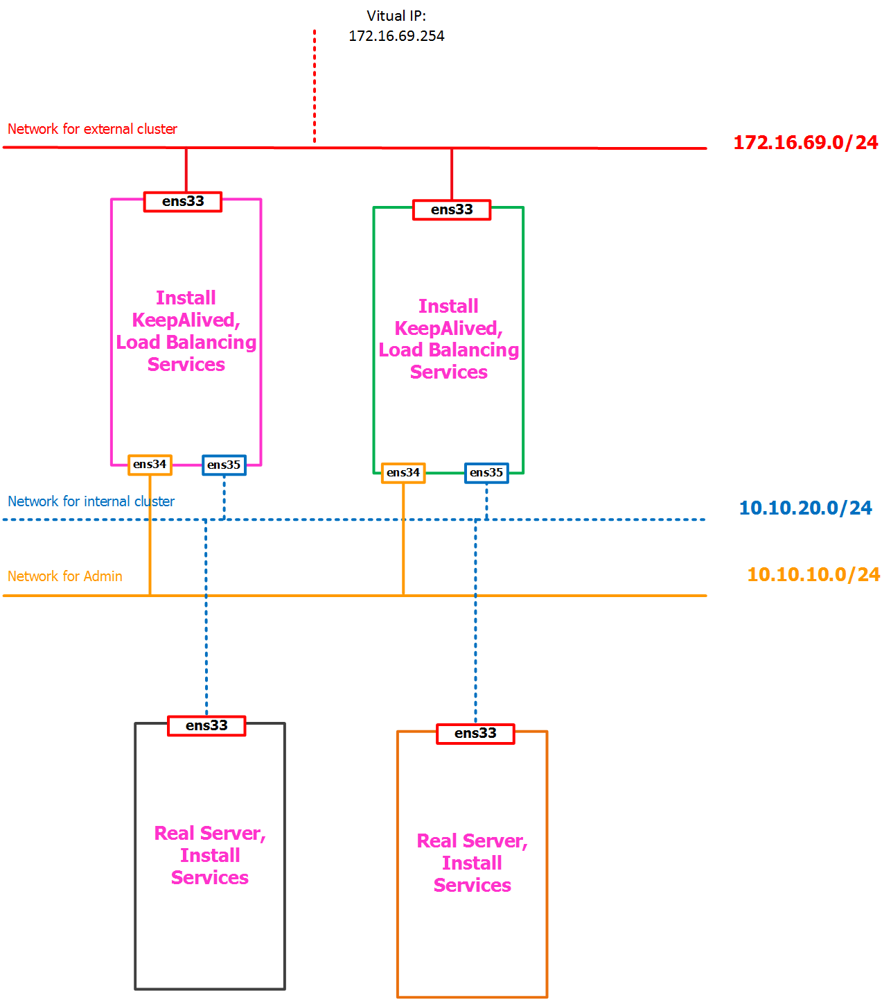

# 2. Tổng quan về Keep Alived

____

# Mục lục

- [2.1 Vấn đề hướng tới của Keep Alived](#issue)
- [2.2 Mô hình sơ khai của một hệ thống sử dụng KeepAlived](#models)
- [2.3 Cài đặt KeepAlived](#install)
- [2.4 Cấu hình kết hợp với HA Proxy để kiểm tra kết quả](#config)
- [Các nội dung khác](#content-others)

____

# <a name="content">Nội dung</a>

- ### <a name="issue">2.1 Vấn đề hướng tới của KeepAlived</a>

	- Load Balancing là một giải pháp tốt cho các dịch vụ ảo hóa. Khi ta thiết kế một topology load balance cần đặc biệt chú ý đến:

		- Tính có sẵn của các real server sử dụng health-checks
		- Tính có sẵn của các load balancer sử dụng failover protocol

	- Để cân bằng tải các real services, cung cấp các dịch vụ ảo hóa trên toàn cầu, và tăng tính sẵn có của các dịch vụ cân bằng tải, chúng ta cần theo dõi từng nút real server. Vấn đề này được giải quyết bằng việc sử dụng health-checks để thao tác trên real servers

	- Mặc khác, khi sử dụng cân bằng tải mà chỉ có một máy chủ đảm nhiệm thì khi có sự cố mà không có một thiết bị dự phòng nào khác đảm nhiệm vai trò của nó sẽ dẫn đến các dịch vụ phải tạm dừng cung cấp. 

	- KeepAlived cố gắng giải quyết 2 vấn đề trên bằng cách thao tác với LVS (Linux Virtual Server) qua việc thêm hoặc xóa các máy chủ thực dựa trên các quyết định của health-checks. Cho phép ta tạo ra một hay nhiều Virtual IP để liên kết các máy chủ mở rộng hệ thống Load Balancing.

- ### <a name="models">2.2 Mô hình sơ khai của một hệ thống sử dụng KeepAlived</a>

	- Mô hình đơn giản khi triển khai KeepAlived như sau:

		

		trong đó:

		+ VIP hay Virtual IP: là địa chỉ IP sẽ được tất các các client sử dụng để truy cập đến hệ thống.
		+ Real Server: là máy chủ chứa các ứng dụng, dịch vụ được truy cập bới các clients.

- ### <a name="install">2.3 Cài đặt KeepAlived</a>

	- Để cài đặt KeepAlived trên Centos 7 - tại node bạn bạn muốn cung cấp dịch vụ Load Balancing, ta sử dụng câu lệnh như sau:

			yum install -y keepalived

	- Sau khi cài đặt thành công, thực hiện chạy câu lệnh sau để cho phép keepalived khởi động cùng hệ thống:

			systemctl enable keepalived
			systemctl start keepalived

- ### <a name="config">2.4 Cấu hình kết hợp với HA Proxy để kiểm tra kết quả</a>

	- Để kiểm tra kết quả, bạn hãy làm các bước như sau tại node thực hiện chức năng Load Balancing:

		Đầu tiên cần chạy câu lệnh:

			cp /etc/keepalived/keepalived.conf /etc/keepalived/keepalived.conf.def
			rm -rf /etc/keepalived/keepalived.conf
			vi /etc/keepalived/keepalived.conf

		sau đó thêm nội dung sau vào file và lưu lại:
			# Script used to check if HAProxy is running
			vrrp_script check_haproxy {
				script "killall -0 haproxy"
				interval 2
				weight 2
			}
			# Virtual interface
			# The priority specifies the order in which the assigned interface to take over in a failover
			vrrp_instance VI_01 {
				state MASTER
				interface ens33
				virtual_router_id 1
				priority 101 # 101 on master, 100 on backup
			# The virtual ip address shared between the two loadbalancers
				virtual_ipaddress {
					172.16.69.254/32
				}
				track_script {
					check_haproxy
				}
			}

		trong đó: 172.16.69.254/24 là địa chỉ Virtual IP với subnet mask là 32 và ens33 là interface cho phép chạy VIP.

	- Khởi động lại keepalived:

			systemctl restart keepalived

		chạy câu lệnh sau để kiểm tra kết quả:

			nmcli

	- Trong các phần tiếp theo sẽ nói rõ ý nghĩa của các câu lệnh trong file cấu hình của KeepAlived. Bạn cũng có thể tham khảo qua file tiếng anh sau tại [Help File - KeepAlived Configuration](../files/helpKeepAlived.conf)

____

# <a name="content-others">Các nội dung khác</a>
