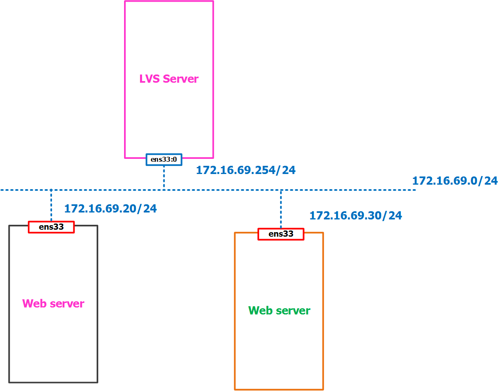
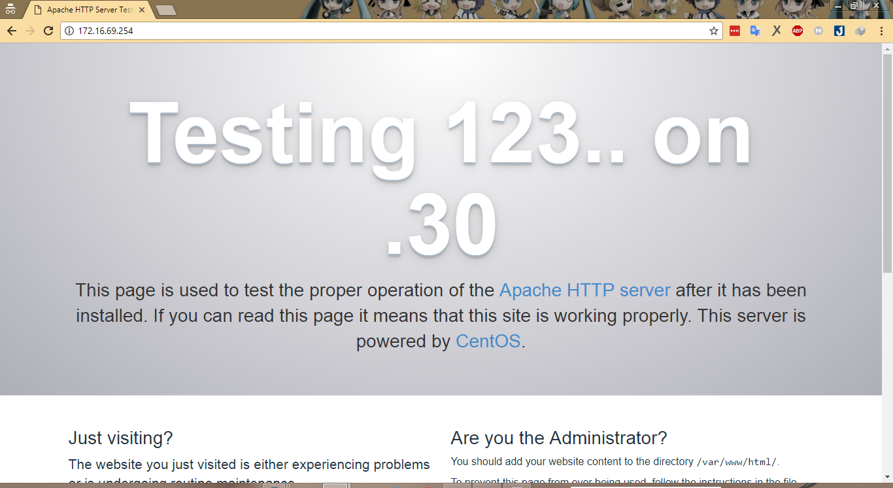

# Báo cáo Cài đặtt LVS sử dụng Direct Routing Mode
____

# Mục lục
- [.1 Giới thiệu về LVS](#about)
-  [.2 Cài đặtt LVS](#install)
- [.3 Cấu hình Network Direct Routing](#config)
- [.4 Kiểm tra kết quả](#test)

____

- ### 

	- LVS là viết tắt của Linux Virtual Server được hình thành từ cluster của nhiều server thật
	- Mục đích:
		+ Xây dựng một hệ thống server đảm bảo tính sẵn sàng cao (High Availability ) và hiệu năng cao (High performance ) sử dụng kỹ thuật cluster
		+ Cung cấp khả năng mở rộng (Scalability ), đáng tin cậy (Reliability ) tốt và có thể sử dụng được (Serviceable )
		+ LVS biết đến như một Load Balancer Cluster.
	- LVS có thể chia sẻ dữ liệu giống nhau giữa các server thật với 2 tùy chọn
		+ Đồng bộ dữ liệu thông qua real server pool
		+ Sử dụng công nghệ của các phần mềm thứ 3 hỗ trợ (Galera )

- ### 

	- Môi trường cài đặt
		+ LVS server sử dụng Ubuntu.
		+ Real server sử dụng Centos (Ubuntu, ...)

	- Mô hình dựng:

		

	- Để cài đặt LVS, trên máy đảm nhiệm chức năng, ta thực hiện chạy câu lệnh sau:

			apt-get install -y ipvsadm

	- Tiếp theo, ta cần sửa đổi cấu hình cho LVS tại file cấu hình `/etc/default/ipvsadm ` sao cho có nội dung như sau:

			# ipvsadm

			# if you want to start ipvsadm on boot set this to true
			AUTO="true"

			# daemon method (none|master|backup)
			DAEMON="master"

			# use interface (eth0,eth1...)
			IFACE="ens33:0"

			# syncid to use
			# (0 means no filtering of syncids happen, that is the default)
			# SYNCID="0"

	- Khởi động LVS:

			systemctl start ipvsadm
			systemctl enable ipvsadm

- ### <a name="config">Cấu hình tạo virtual ip trên LVS server</a>

	-  Đầu tiên, để tạo ra một ip ảo (VIP ) cho LVS server. Trên LVS server, ta làm như sau:

			vi /etc/network/interfaces 

		thêm nội dung sau vào file:

			auto ens33:0
			iface ens33:0 inet static	
			address 172.16.69.254
			network 172.16.69.0
			netmask 255.255.255.255

		lưu lại file, và khởi động lại interface đã tạo:

			ifup ens33:0

	- Tiếp theo, ta sẽ cấu hình network cho LVS để chuyển tiếp gói tin theo kiểu Direct Routing. Trên LVS server, ta chạy các câu lệnh sau:

		tạo server pool, rr là chế độ cấu hình cho load balancing là round robin

			ipvsadm -A -t 172.16.69.254:80 -s rr

		add real server backend, -g chỉ chế độ mạng sử dụng cho LVS chuyển tiếp gói tin là Direct Routing, -m tương đương với NAT.

			ipvsadm -a -t 172.16.69.254:80 -r 172.16.69.20:80 -g
			ipvsadm -a -t 172.16.69.254:80 -r 172.16.69.30:80 -g

		xác nhận cấu hình, kiểm tra kết quả cấu hình đã đúng hay chưa

			ipvsadm -l

		kết quả sẽ hiển thị tương tự như sau:

			IP Virtual Server version 1.2.1 (size=4096)
			Prot LocalAddress:Port Scheduler Flags
			  -> RemoteAddress:Port           Forward Weight ActiveConn InActConn
			TCP  172.16.69.254:80 rr
			  -> 172.16.69.20:80     Route   1      0          0
			  -> 172.16.69.30:80     Route   1      0          0

	- Trên cả 2 backend phía sau. Ta cần chạy câu lệnh sau để chuyển tiếp gói tin:

			iptables -t nat -A PREROUTING -d 172.16.69.254 -j REDIRECT

		
- ### <a name="test">Kiểm tra kết quả</a>

	- Để kiểm tra kết quả, từ trình duyệt của client, ta truy cập tới địa chỉ 172.16.69.254 (ta cần khởi động lại LVS server trước khi thực hiện bước này ). Kết quả như sau:
	
		

	và

		